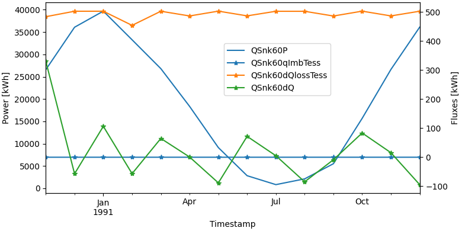

.. _make_plots_with_two_y_axes:

*******************************
How to make plots with two y-axes
*******************************

There are multiple plots available to use in your processing steps.
Here you can find examples for a line plot and a stacked bar chart.
The required arguments for most plots are the dataframe and the columns you would like to plot.

Line Plot
_________

.. code-block:: python

    fig, lax, rax = plot.get_figure_with_twin_x_axis()
    plot.line_plot(monthly_data, ["QSnk60P"], ylabel="Power [kWh]", use_legend=False, fig=fig, ax=lax)
    plot.line_plot(monthly_data, ["QSnk60qImbTess", "QSnk60dQlossTess", "QSnk60dQ"], marker="*", ylabel="Fluxes [kWh]", use_legend=False, fig=fig, ax=rax)
    fig.legend(loc="center", bbox_to_anchor=(0.6, 0.7))
    # https://matplotlib.org/stable/api/_as_gen/matplotlib.figure.Figure.legend.html

.. Note::
    Be careful when combining plots. MatPlotLib will not complain when you provide incompatible x-axes.

    An example:
    combining a time-series with dates with a histogram with temperatures.
    In this case, the histogram will disappear without any feedback.

