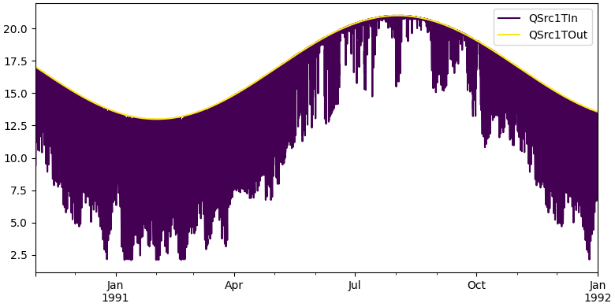
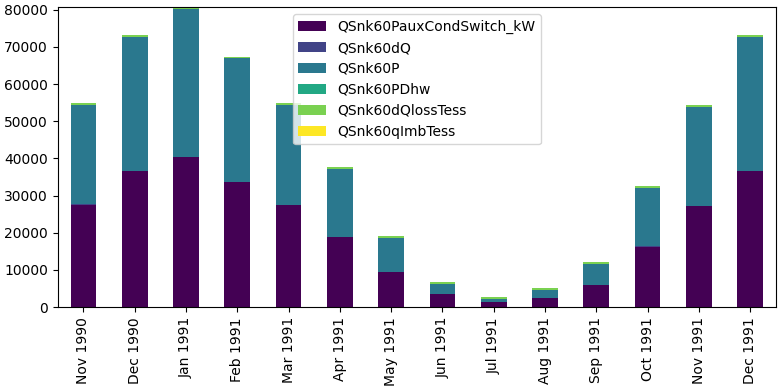

.. _use_plots:

*******************************
How to Use Plots
*******************************

There are multiple plots available to use in your processing steps.
Here you can find examples for a line plot and a stacked bar chart.
The required arguments for most plots are the dataframe and the columns you would like to plot.

Line Plot
_________

.. code-block:: python

    api.line_plot(df=simulation.hourly, columns_to_plot=["column_1", "column_2"])

Stacked Bar Chart
_________________

.. code-block:: python

    api.stacked_bar_chart(df=simulation.monthly, columns_to_plot=["column_1", "column_2"])

